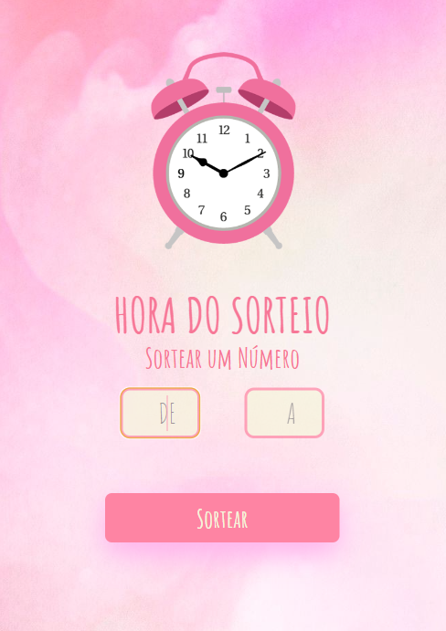
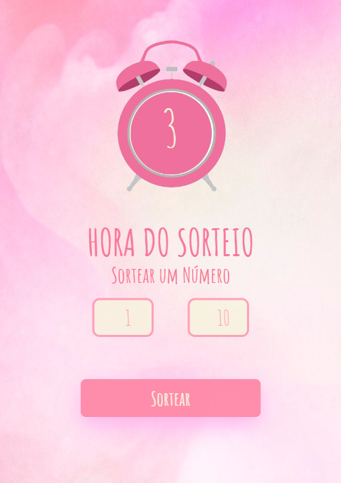

<H1>Sorteador de números</h1>
 
 
<h3>

Bem-vindo à aplicação do sorteio! Esta é uma página web interativa que permite aos usuários sortear um número aleatório dentro de um intervalo especificado. A interface foi projetada pensando na experiência do usuário, com validações para garantir que apenas números positivos e de até quatro dígitos sejam aceitos.

<h3>
 
<h1>Funcionalidades<h1>
<h3>

 -> Definir um número mínimo e máximo para o sorteio, limitando os valores possíveis.
     
    -> Clicar no botão "Sortear" para gerar um número aleatório dentro do intervalo especificado.
     
    -> Exibir o número sorteado de forma visualmente atraente na imagem central na sobreposição.
     
    

<h3>
 
 
<h2>Link de acesso: https://gabrielabade.github.io/sorteio/<h2>
 
 
<h2> Tecnologias utilizadas</h2>
 
 
 
 
 
 
<h2>Demonstração</h2>
 

